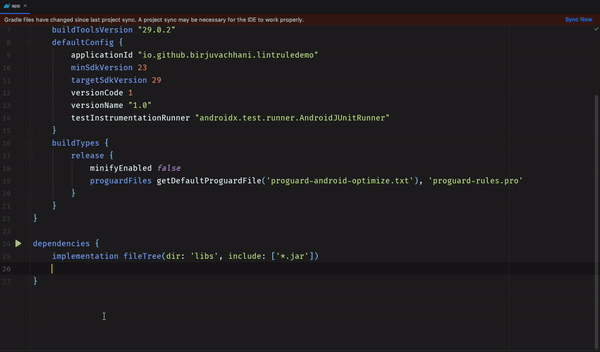
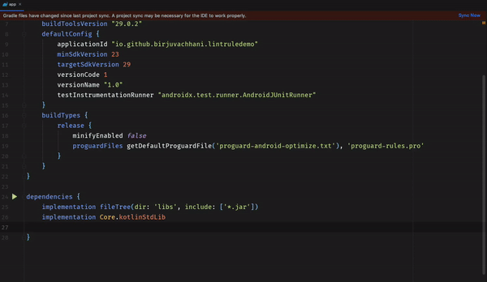

# Gradle Utils
A small utility for gradle dependency management that saves a lot of precious time of developer wasted on finding required
dependencies for Android libraries.

Remember that time when you need to create new project and add all the required dependencies? Googling each and every dependency
and adding it to the `build.gradle` file is such a pain. No one dares to try to remember those dependencies with their
version (unless you're a quantum computer or Alien) as it's very difficult to remember.

Another option is to use **project structure dialog** from which we can search for dependencies on `jcenter` and `google` repositories
and add them to our project. But it doesn't work properly often. It never shows some dependencies or shows a lot of dependencies with
third-party libraries and makes it harder to get the one you want. Even if it works for you, then everytime you have to do it
for very **common** and **standard** dependencies like adding `recyclerview`, `retrofit` or `room`. 

**Gradle utils** can help you with that! All you have to do is run a simple command. This utility makes use of [**Gradle kotlin DSL**](https://docs.gradle.org/current/userguide/kotlin_dsl.html)
and [**buildSrc**](https://stackoverflow.com/a/13875350/9199362) folder to do the **magic**! If you don't know what are those and how it works, refer to the quick explanation [here](https://birjuvachhani.cf).

Alright! It's fine if you don't know the details on how it works, you can still use it easily.



> It is an attempt to reduce a developer's work of finding dependencies and using them. It allows you to use majority
of common dependencies that an Android developer needs everyday. Note that it has a limited set of pre-available dependencies which you
can use in your project.

> You won't be able to find all the third-party dependencies that you use as there are quite large number of
libraries out there and it doesn't make sense to include all of them. But if you find any useful and very common library missing,
you're always welcome to contribute to that or to raise an issue on github.

#### Note: This is utility is under development and will be released soon released! Although, you can use available dependencies. It's completely safe.

# Features
* Auto complete support
* Easy to remember and use
* Doesn't affect your APK size
* Allows to use custom versions
* Easy to install and modify
* Integrates nicely with `build.gradle` and extensively with `build.gradle.kts`.
* Make your life easy!

# Installation
open terminal at the root of your project or open terminal in Android studio and execute the following command. Please note that
this command is very primary and it assumes that you're running it for the first time, so if you're not running it for the first time,
be sure to delete `buildSrc` folder from the root directory of your project before executing it.

#### Windows:

```shell
git clone https://github.com/birjuvachhani/gradle-utils.git && xcopy  gradle-utils\buildSrc buildSrc /e /i /h && RMDIR /Q/S gradle-utils && gradlew build
```
#### Mac & Linux:

```shell
git clone https://github.com/birjuvachhani/gradle-utils.git && cp -a gradle-utils/buildSrc ./ && rm -rf gradle-utils && chmod -R 777 ./gradlew && ./gradlew build
```

# How to use
Once you install it on your project and gradle build suceeds, you can get rid of all the static dependencies in your build.gradle file.

You can find the list of all the available dependencies [**here**](https://github.com/BirjuVachhani/gradle-utils/blob/master/app/build.gradle)

It is very easy to use this utility. All you have to do it just think of what you want to add. Let's see one example:

This what we used to do before:
Suppose we want to add recyclerview dependency, we google it or use project structure dialog to get the dependency which looks like this:
`androidx.recyclerview:recyclerview:1.x.x`, which looked like this in your `build.gradle` file:

```groovy
dependencies {
    implementation 'androidx.recyclerview:recyclerview:1.x.x'
}
```

Now, you only have to write what you want. It looks much better an very easy to remember:

```groovy
dependencies {
    implementation AndroidX.recyclerView
}
```

Want to add room? Easy...

```groovy
dependencies {
    implementation Room.runtime
    implementation Room.compiler
}
```

This by default uses latest version. Want to change room version?

```groovy
dependencies {
    Room.version = "2.0.0"
    implementation Room.runtime
    implementation Room.compiler
}
```
It will change the version of all the room dependencies that you use! Isn't is awesome?

Alright! Room has multiple dependecies so you could access `version` property and you changed the version used for Room.
But what if you want to change the version of a single dependency like `AppCompat`? That's also easy:

#### build.gradle

```groovy
dependencies {
    implementation With.version(AndroidX.appCompat,"1.0.2")
}
```
Syntax for `.build` file is a little bit lengthy as it doesn't support kotlin's beautiful syntax. Checkout this demo below:



#### build.gradle.kts

```groovy
dependencies {
    implementation(AndroidX.appCompat version "1.0.2")
}
```

Checkout this demo below:


### Pull Request
To generate a pull request, please consider following [Pull Request Template](https://github.com/BirjuVachhani/gradle-utils/blob/master/PULL_REQUEST_TEMPLATE.md).

### Issues
To submit an issue or a feature request, please check the [Issue Templates](https://github.com/BirjuVachhani/gradle-utils/issues/new/choose).

Code of Conduct
---
[Code of Conduct](https://github.com/BirjuVachhani/gradle-utils/blob/master/CODE_OF_CONDUCT.md)

## Contribution

You are most welcome to contribute to this project! We're looking for contributors who add missing dependencies, update versions and help to manage documentation.


Please have a look at [Contributing Guidelines](https://github.com/BirjuVachhani/gradle-utils/blob/master/CONTRIBUTING.md), before contributing and proposing a change.

# License

```
   Copyright © 2019 BirjuVachhani

   Licensed under the Apache License, Version 2.0 (the "License");
   you may not use this file except in compliance with the License.
   You may obtain a copy of the License at

       http://www.apache.org/licenses/LICENSE-2.0

   Unless required by applicable law or agreed to in writing, software
   distributed under the License is distributed on an "AS IS" BASIS,
   WITHOUT WARRANTIES OR CONDITIONS OF ANY KIND, either express or implied.
   See the License for the specific language governing permissions and
   limitations under the License.
```
